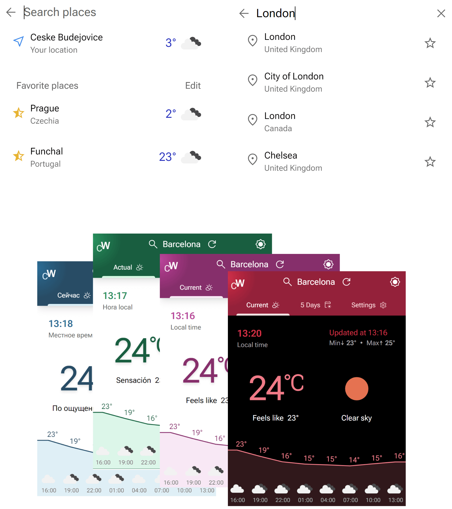

# [ColorWeather](https://weather.pavelgrinkevich.com/)


[ColorWeather](https://weather.pavelgrinkevich.com/) is a weather app that supports multiple color themes and languages. Developed with modern frameworks, it works across different browsers and screen resolutions.

## Features



- Get a detailed **current** and **5-day weather forecast** for your current location and any city in the world.
- **Search** for cities and add them to **favories** to check out conditions and forecasts later.
- Find out detailed **temperature** and **wind** information, humidity, pressure and **length of the day**.
- Check out **air quality** and pollution at any location.
- Choose from **15 color themes** and switch between **light** and **dark** modes.
- Elect from **five languages** for both UI and forecast.

## Technologies

- Developed with [Next.js 13](https://nextjs.org/) & [Tailwind CSS](https://tailwindcss.com/), the app uses modern technologies such as **Next.js API** routes and **mobile-first UI design** approach.
- **Weather information** is fetched from [OpenWeather APIs](https://openweathermap.org/) and complemented by [BigData Cloud Reverse Geocoding APIs](https://www.bigdatacloud.com/packages/reverse-geocoding) for more precise location names.
- **Color palletes** were generated with [Tailwind CSS Color Generator](https://uicolors.app/create).
- [Material Symbols](https://fonts.google.com/icons) iconography
- Main dependencies: `react`, `next`, `tailwindcss`, `typescript`, `clsx`, `eslint`

## How to Run

First, clone the repository and run development server:

```bash
git clone https://github.com/elquespera/weather-app.git
cd weather-app

npm run dev
# or
yarn dev
# or
```

Note: API keys from OpenWeather and [BigCloud Data](https://www.bigdatacloud.com/packages/reverse-geocoding) are needed for the app to fetch the forecasts properly. Add them to `.env.local` along with other envinronment variables:

```env
OPEN_WEATHER_URL=https://api.openweathermap.org/data/2.5/
OPEN_WEATHER_GEO_URL=http://api.openweathermap.org/geo/1.0/
OPEN_WEATHER_KEY={your api key here}
BIG_DATA_CLOUD_URL=https://api.bigdatacloud.net/data/
BIG_DATA_CLOUD_KEY={your api key here}
```
